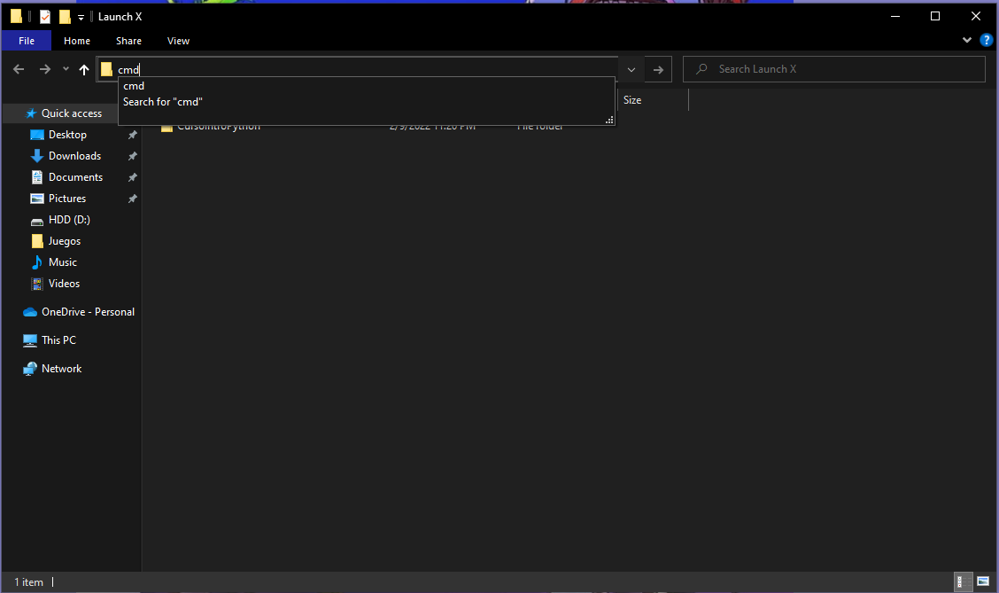
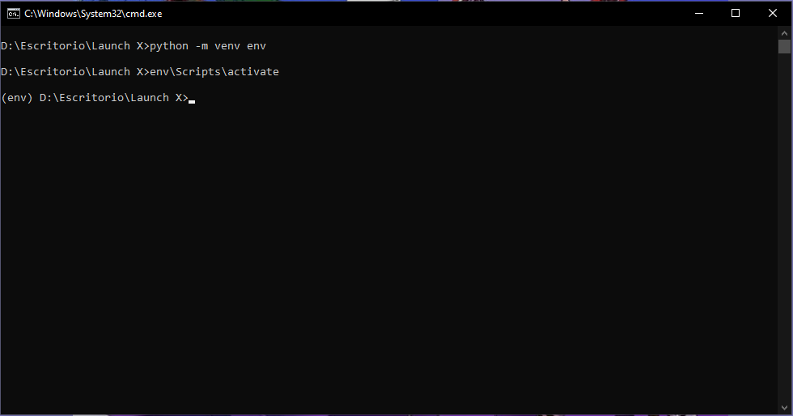
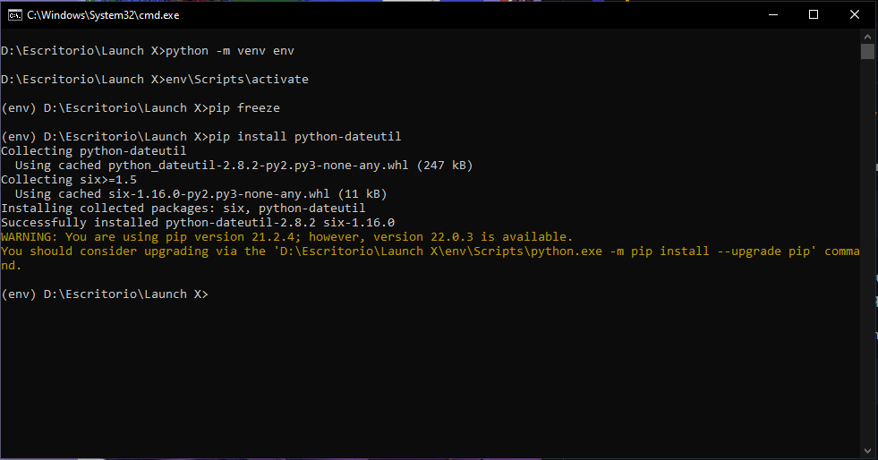
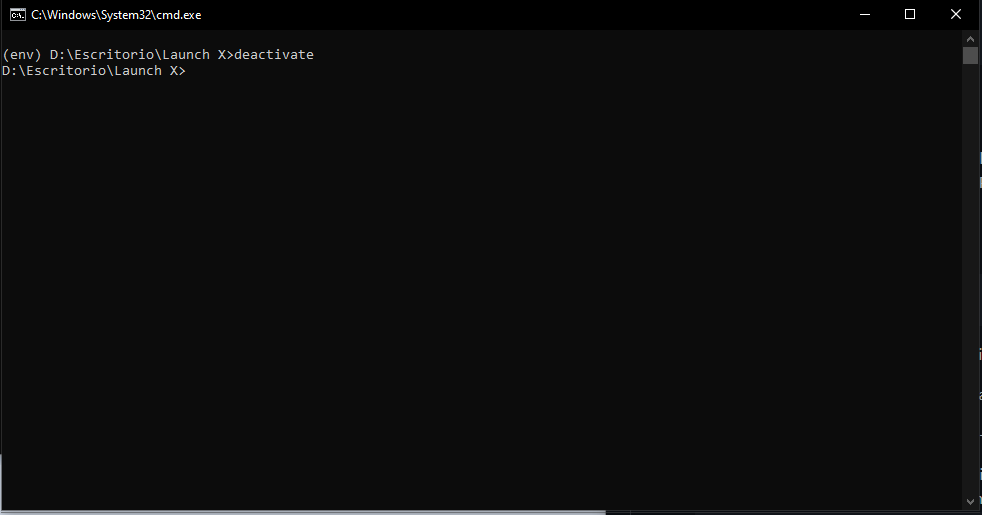

# Crear un paquete

Se utiliza un entorno virtual para trabajar de manera aislada con paquetes u otros programas que se ejecutan, de esta forma estos procesos se mantendran en un entorno virtual en lugar de funcionar globalmente en el equipo

## Crear un entorno virtual

Primero debemos abrir una terminal de windows y colocarnos en el directorio donde vamos a almacenar nuestro entorno virtual, una forma facil de hacerlo si utilizas windows es abriendo la carpeta donde quieres crear tu entorno y en la barra superior escribimos cmd y presionamos enter y nos abre una terminal en este directorio.



## Instalación
Ahora utilizamos ``venv`` para crear nuestro entorno con el siguiente comando

```
python -m venv env
```

Esto creara un directorio con el nombre de ``env`` en la ubicacion que elegimos


## Activación
Una vez creado nuestro entorno lo activamos con el siguiente comando

```
env\Scripts\activate
```

En algunas ocasiones para windows puede ser el comando

```
env\bin\activate
```

Cuando se active correctamente nuestro entorno en la terminal se agregara la palabra ``(env)`` al inicio como se ve a continuacion:



## Instalación de una biblioteca

Una vez estamos dentro de nuestro entorno virtual, instalaremos una biblioteca y asi comprobaremos que la biblioteca solo existe en el entorno virtual

* con el comando ``pip freeze`` podemos ver todas las bibliotecas intaladas en nuestro entorno:

```
pip freeze
```

Como estamos en un entorno nuevo no existen bibliotecas instaladas por lo que no habra respuesta

* Usaremos el comando ``pip install`` para instalar nuestra primer biblioteca como el siguiente ejemplo:

```
pip install python-dateutil
```

* A continuacion aparecera texto indicando la que se lleva a cabo la instalacion de la biblioteca y al finalizar podremos observar algo como lo siguiente:

```
Successfully installed python-dateutil-2.8.2 six-1.16.0
```


* Ahora con una biblioteca instalada corremos de nuevo  ``pip freeze`` para listar las bibliotecas
```
pip freeze
```

* Deberiamos ver una lista como la siguiente
```
python-dateutil==2.8.2
six==1.16.0
```


## Desactivando el entorno virtual

En este punto hemos creado un entorno virtual e instalamos un paquete, esta configuracion es suficiente para el proyecto que necesitemos trabajar, pero para cambiar entre varios entornos y diferentes proyectos es necesario salir(deactivate) nuestro entorno virtual

 El entorno virtual se cierra con el comando ``deactivate``:
```
deactivate
```

Podemoos ver como la palabra ``(env)`` desaparece en nuestra terminal



Con esto hemos terminado, felicidades hemos creado y usado un entorno virtual!